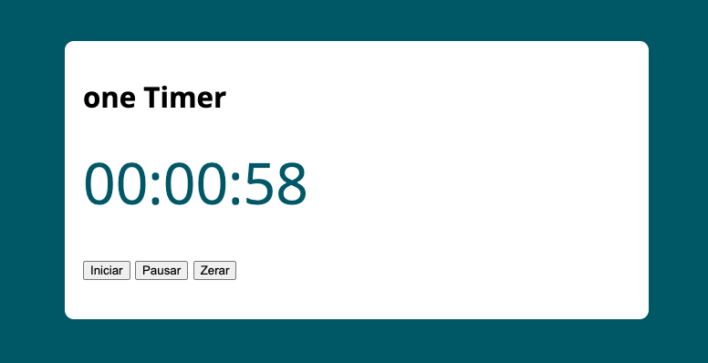

# one Timer
Just a Timer

## Goal
 - [x] Practice studying the basic Javascript date type

> [!Tip]
> [Clique aqui ou na imagemm abaixo para acessar o site](https://marinhotjr.github.io/timer)

> [!Note]
> App suggested as an exercise in the js course [Otávio Miranda - Udemy](https://www.udemy.com/course/curso-de-javascript-moderno-do-basico-ao-avancado/?couponCode=KEEPLEARNING)

**Made with love :heart: by @marinhotjr - 2024**